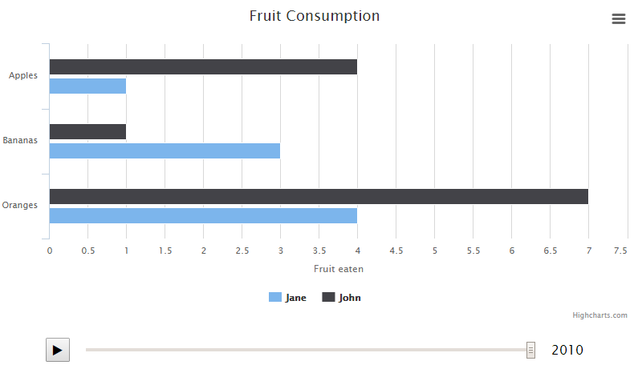

# Timeline Highcharts Plugin
The Timeline Highcharts Plugin adds an interactive timeline to any Highcharts chart (Highcharts, Highmaps and Highstock).


## Reporting Issues
Before reporting an issue, please follow these guidelines:
* Thoroughly check if the issue already exists
* Make sure the report includes a reproducible demo. Use for example [Highcharts' own standard jsFiddle](http://jsfiddle.net/highcharts/llexl/), adding your own code and stripping it down to an absolute minimum needed to demonstrate the bug.
* Describe your environment. Not the weather, but 

## Usage
### 1. Import Timeline Script
Import `timeline.js` after you import Highcharts, Highmaps or Highstock:
```html
<script src="http://code.highcharts.com/highcharts.js"></script>
<script src="path/or/url/to/timeline.js"></script>
```
### 2. Add Timeline Options
Add a `timeline: {}` option object to your chart options:
```javascript
...
timeline: {
    enabled: true, // optional. Defaults to true
    begin: 2000, // required
    end: 2010, // required
    series: 0, // required. The series which holds points to update. Integer or Array of integers
    axisLabel: 'year', // optional. name-attribute of timeline slider. Defaults to 'year'
    autoPlay : true, // optional. Defaults to false
    updateInterval: 10, // optional. Defaults to 10
    magnet: { // optional
        round: 'floor', // optional. Math.round type. ceil / floor / round. Defaults to 'round'
        step: 0.02 // optional. Defaults to 0.01
    }
},
...
```
### 3. Add Timeline Data
Add a `data: []` array to each point with values to iterate through in ascending order:
```javascript
...
series: [{
    name: 'Jane',
    data: [
        {
            y: 1,
            data: [1, 5, 2, 7, 7, 1, 6, 9, 2, 5, 1]
        }, {
            y: 3,
            data: [5, 5, 7, 7, 3, 8, 9, 9, 1, 7, 3]
        }
    ]
},
...
```
And that should be it!

## Controls
Timeline currently supports the following controls:
* play/pause clicking the play/pause button
* play/pause by hitting space
* navigating the timeline by dragging the slider thumb
* navigating the timeline by hitting the left and right arrow keys

**NB!** To make key input work, make sure the timeline is in focus by selecting it first
